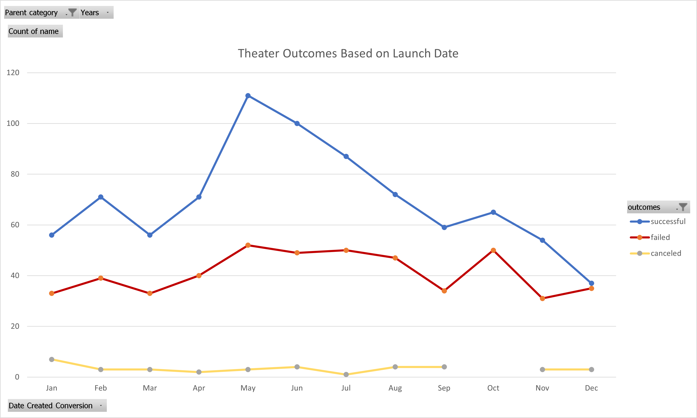
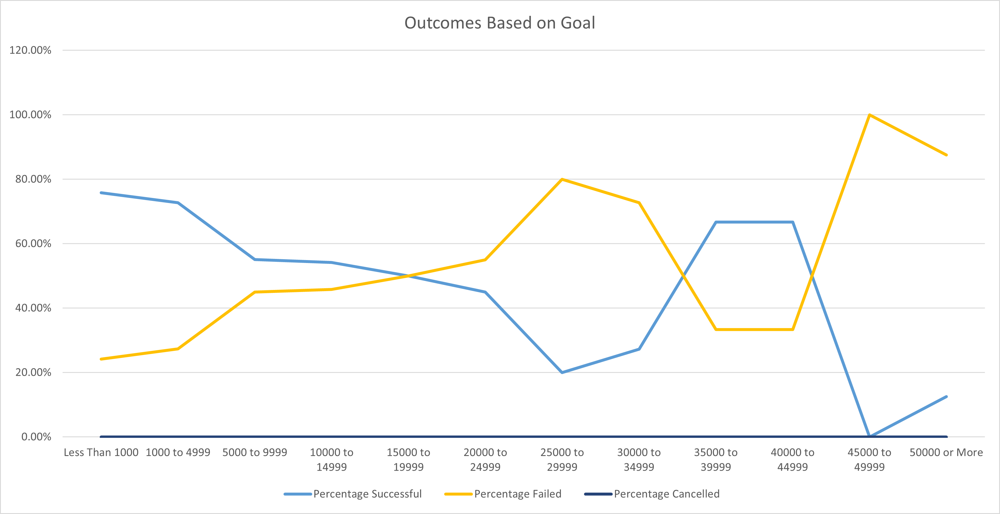

# kickstarter-analysis

### Overview of Project
With this project we have been tasked with finding the optimal launch date and duration for Louise's play kickstarter. We have been given a large dataset of many kickstarters with many different categories of projects, funding goals, launch dates, time ranges and many other variables.
## Purpose and Background
The purpose of this project is to narrow down to data that will be related to the specific category of helping Louise and finding what data will be most helpful in finding a proper launch time for her play.
## Analysis and Challenges
With only plays taken from the dataset of all kickstarters the next challenge was to find what is important from this data, and how it can be used. For this project we will use data from other play kickstarters to find the best time to launch and a proper goal to set.
### Analysis of Outcomes Based on Launch Date
While looking at past kickstarter plays it has been determined that May will be the best month to launch a play project. May has the highest number of successful play projects to launch, with 111 successful projects. To get Louise on the proper path for success of her project May is the month to launch. 
### Analysis of Outcomes Based on Goals
Our next step of analysis was how high Louise's goal should be. Looking at the data the highest point of successful play funding is less than $1000 at 75.81% successful. It should be noted that when funding gets much higher from 35000 to 39999 and 40000 to 44999 ranges the are the only other times the success rate jumps back up to roughly the same rate of success. However, there are fewer projects total in that range so it would not be wise to have the goal set that high. 
### Challenges and Difficulties Encountered
Some challenges that were encountered while looking at these variables were filtering the launch date down to the month it launched, rather than the full date in excel. Another challenge faced was finding if it would be more beneficial  to have Louise's goal be set to $35000 to $44999 because of the closeness in success rates for such a higher amount of money.
## Results

- What are two conclusions you can draw about the Outcomes based on Launch Date?
It can be concluded that statically May is the best and worst month to launch a play. While May has the highest number of successful projects at 111, it also has the highest failed projects at 52.
- What can you conclude about the Outcomes based on Goals?
Based on the goals we have examined it will be best for Louise to have her goal set to less than $1000. As mentioned before, it may be tempting to launch with a higher goal as the success rate appears similar. However, there is less data to pull from at these higher numbers and the success rate remains lower.
- What are some limitations of this dataset?
A limitation to this dataset is we do not have a readable value set for the duration of these campaigns. While there is data populating the cells, we are unsure what they translate to. If this data was readable it would be a valuable asset to the data we have already examined to get a better insight of when Louise should launch her kickstarter.
- What are some other possible tables and/or graphs that we could create?
Another dataset/graph that we could create (with the proper values) is the duration of the campaigns.
